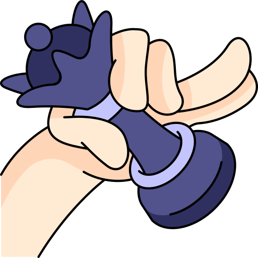

<a href="#">
    <a>
     
    <H1 style="color:#07dd63;">Chess Game</H1></H4>
    
 

# ChessGame

Welcome to our Chess Game! This is a simple WinForm chess game implemented in c#.

## Features
- Classic chess gameplay with all standard rules.
- Player vs. Player mode: Play against a friend on the same device.
- Save/Load game functionality: Save your progress and resume your game later.
- Move validation: Prevents illegal moves, ensuring a fair and accurate gameplay experience.
- standard timing rules (Classic / Rapid / Blitz)

## Controls
- Use the arrow keys or algebraic notation to select and move pieces.

.png>)
  

.png>)
  

.png>)
  

.png>)
  

## contributors 

